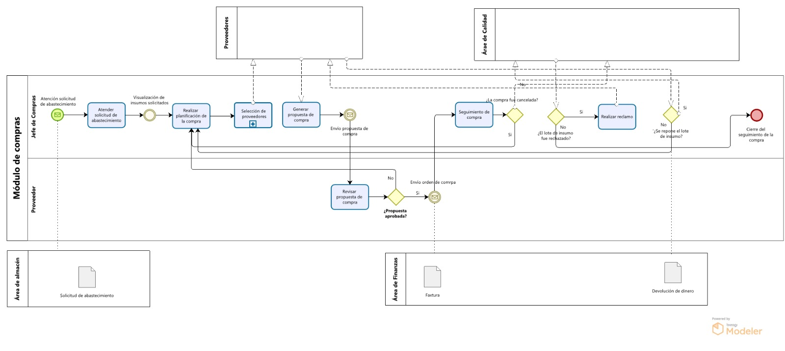

### Módulo Proceso de compra

| N° | Actividad                          | Descripción                                                                 | Responsable           |
|----|------------------------------------|-----------------------------------------------------------------------------|------------------------|
| 1  | **Revisión de la solicitud de abastecimiento** | El operario de compras revisa la solicitud de abastecimiento, donde se detallan los insumos pedidos por el área de almacén. | Operario de Compras  |
| 2  | **Realización de la planificación de la compra** | El operario de compras selecciona posibles proveedores para realizar la compra. La propuesta incluye detalles del insumo, cantidades requeridas, condiciones esperadas de entrega y posibles descuentos. | Operario de Compras  |
| 3  | **Generación de propuesta de compra** | El operario de compras elabora una propuesta formal, seleccionando proveedores registrados previamente. Este documento es registrado en el sistema para su posterior evaluación.| Operario de Compras  |
| 4  | **Revisión de la propuesta** | El jefe de compras revisa cuidadosamente las condiciones pactadas en la propuesta: fecha de entrega estimada, costo total, descuentos aplicados y cumplimiento de políticas internas. Si todo está correcto, aprueba la propuesta para pasar a la siguiente fase. | Jefe de Compras  |
| 5  | **Generación de orden de compra** | A partir de la propuesta validada, el jefe de compras genera una orden de compra oficial. Este documento sirve como contrato y detalla el acuerdo entre la empresa y el proveedor. | Jefe de Compras   |
| 6  | **Envío orden de compra** | El jefe de compras envía la orden de compra oficial al área de finanzas, este con el objetivo de realizar el pago de los lotes de insumos a adquirir. | Jefe de Compras   |
| 7  | **Seguimiento de la compra** | Se tiene un control continuo de la compra, esto para verificar si se está cumpliendo con los plazos acordados para su entrega, como también registrar los nuevos lotes de insumo que ingresarán a calidad. | Operario de Compras  |
| 8  | **Atención del reclamo** | En caso de que el área de calidad rechaze algun lote de insumo, se deberá contactar con el proveedor para realizar la reposición del lote o la devolución del dinero. | Operario de Compras |
